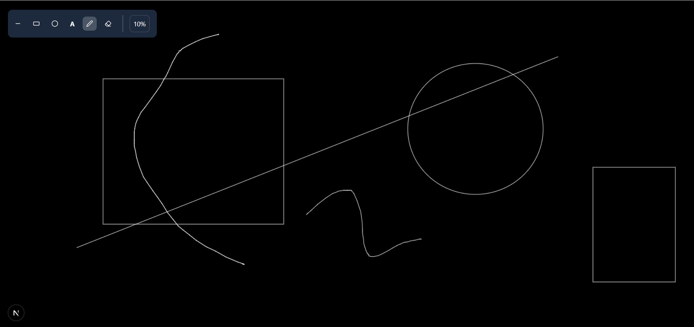

# 🖊️ DoodleX — Collaborative Drawing Board

**DoodleX** is a real-time collaborative drawing platform where multiple users can draw together on a shared canvas, powered by WebSockets for instant updates. Whether you're brainstorming ideas, sketching UI wireframes, or just doodling with friends, DoodleX makes collaboration fun and seamless.

---

## Tech Stack

| Category     | Technologies                                                                                                                                        |
| ------------ | --------------------------------------------------------------------------------------------------------------------------------------------------- |
| **Frontend** | [Next.js](https://nextjs.org/), [TypeScript](https://www.typescriptlang.org/), [Tailwind CSS](https://tailwindcss.com/)                             |
| **Backend**  | [Node.js](https://nodejs.org/), [Express.js](https://expressjs.com/), [WebSockets](https://developer.mozilla.org/en-US/docs/Web/API/WebSockets_API) |
| **Database** | [PostgreSQL](https://www.postgresql.org/) + [Prisma ORM](https://www.prisma.io/)                                                                    |
| **Monorepo** | [Turborepo](https://turbo.build/repo)                                                                                                               |

---

## Features

- Real-time collaborative canvas using WebSockets
- Multi-user drawing synchronization
- Session-based board saving with PostgreSQL + Prisma
- infinite scroll

---

## Screenshots

| Dashboard                                               | Canvas Collaboration                              |
| ------------------------------------------------------- | ------------------------------------------------- |
|  |  |

---

## Installation & Setup

```bash
# Clone the repository
git clone https://github.com/yourusername/doodleX.git
cd doodleX

# Install dependencies
npm install

# Setup environment variables
# (create a .env file based on .env.example)

# Run database migrations
npx prisma migrate dev

# Start the development server
npm run dev
```
